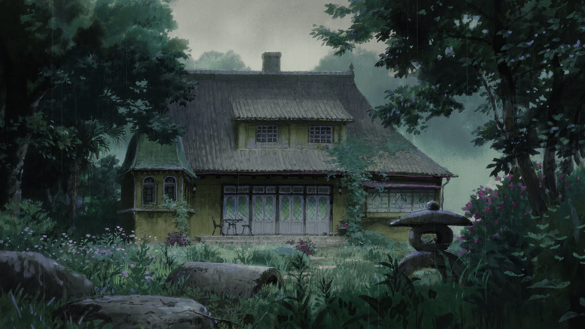
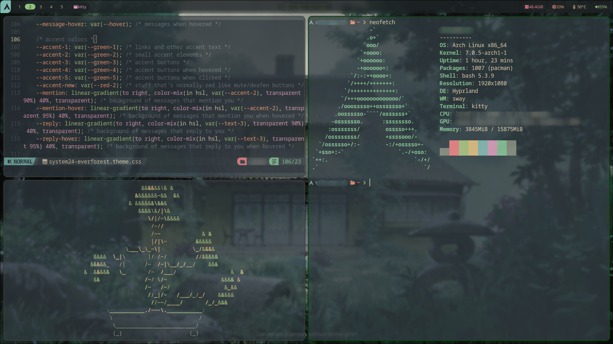

<div align="center">



<br/>
<br/>

```
 ██╗  ██╗██╗   ██╗██████╗ ██████╗ ██╗      █████╗ ███╗   ██╗██████╗
 ██║  ██║╚██╗ ██╔╝██╔══██╗██╔══██╗██║     ██╔══██╗████╗  ██║██╔══██╗
 ███████║ ╚████╔╝ ██████╔╝██████╔╝██║     ███████║██╔██╗ ██║██║  ██║
 ██╔══██║  ╚██╔╝  ██╔═══╝ ██╔══██╗██║     ██╔══██║██║╚██╗██║██║  ██║
 ██║  ██║   ██║   ██║     ██║  ██║███████╗██║  ██║██║ ╚████║██████╔╝
 ╚═╝  ╚═╝   ╚═╝   ╚═╝     ╚═╝  ╚═╝╚══════╝╚═╝  ╚═╝╚═╝  ╚═══╝╚═════╝
```

### 🌿 *a rainy day in the forest* 🌿

<br/>


</div>

---

<div align="center">

## 📸 Preview



> *nvim + neofetch on Kitty — Everforest dark, Ghibli wallpaper*

</div>

---

<div align="center">

## 🎨 Palette

|  | Color | Hex | Role |
|--|-------|-----|------|
| 🟫 |  | `#1E2326` | Background |
| 🟩 |  | `#2E383C` | Surface |
| 🟨 |  | `#D3C6AA` | Foreground |
| 🟢 |  | `#A7C080` | Green (accent) |
| 🔵 |  | `#7FBBB3` | Blue |
| 🟣 |  | `#D699B6` | Purple |
| 🔴 |  | `#E67E80` | Red |
| 🟠 |  | `#E69875` | Orange |

</div>

---

## 🗂 What's Inside

```
~/.config/
├── 🪟  hypr/          Hyprland · Hyprlock · Hyprpaper · Hypridle
├── 📊  waybar/        Status bar
├── 🐱  kitty/         Terminal (Everforest theme + cursor trail)
├── 🔍  wofi/          App launcher
├── 🚪  wlogout/       Logout menu
├── 🔔  dunst/         Notifications
├── 📝  nvim/          Neovim (NvChad)
├── 🎵  easyeffects/   Mic EQ for Blue Snowball
├── 🎶  ncspot/        Terminal Spotify client
├── 🎬  mpv/           Media player
├── ⭐  starship.toml  Shell prompt
├── 🖥  neofetch/      System info
├── 📁  session/       Session config
├── 🎥  yt-x/          YouTube TUI
└── 🖼  Ghibli.png     Wallpaper
```

---

## 📦 Dependencies

<details>
<summary><b>Pacman packages</b></summary>

```bash
sudo pacman -S \
  hyprland hyprpaper hyprlock hypridle \
  xdg-desktop-portal-hyprland \
  waybar wofi dunst kitty \
  neovim starship neofetch mpv dolphin \
  pipewire pipewire-pulse wireplumber \
  easyeffects satty rsync \
  ttf-jetbrains-mono-nerd ttf-iosevka-nerd \
  noto-fonts noto-fonts-emoji \
  qt5ct qt6ct gtk3 gtk4 cava swayosd
```

</details>

<details>
<summary><b>AUR packages (via yay)</b></summary>

```bash
yay -S hyprshot matugen wlogout ncspot yt-x
```

</details>

<details>
<summary><b>Fonts</b></summary>

| Font | Used for |
|------|----------|
| JetBrains Mono Nerd Font | Terminal, clock, UI text |
| Iosevka Nerd Font | Icons and symbols |

</details>

---

## 🚀 Install

```bash
git clone https://github.com/UrTexts/Hyprland-dots.git ~/dotfiles
cd ~/dotfiles
bash install.sh
```

> [!NOTE]
> Works on **Arch Linux** and **Fedora**. The script auto-detects your distro.

> [!TIP]
> Existing configs are backed up as `.bak` files — nothing gets deleted.

The install script handles:

- ✅ Package installation (pacman or dnf)
- ✅ Symlinking all configs to `~/.config/`
- ✅ Everforest cursor theme installation
- ✅ PipeWire service activation
- ✅ Starship added to `.zshrc`

---

## 🔒 Lock Screen

Hyprlock is configured with a blurred Ghibli wallpaper, JetBrains Mono clock, and a minimal password field.

To lock manually:

```bash
hyprlock
```

---

## 🖼 SDDM Greeter

If you're using the `matugen-minimal` SDDM theme, set the wallpaper with:

```bash
sudo cp ~/.config/Ghibli.png /usr/share/sddm/themes/matugen-minimal/wallpaper.jpg
```

---

## 🔄 Syncing Changes

```bash
bash sync.sh
```

Copies all configs and pushes to GitHub automatically.

---

<div align="center">

*built on arch, vibes from the forest* 🌲

</div>
